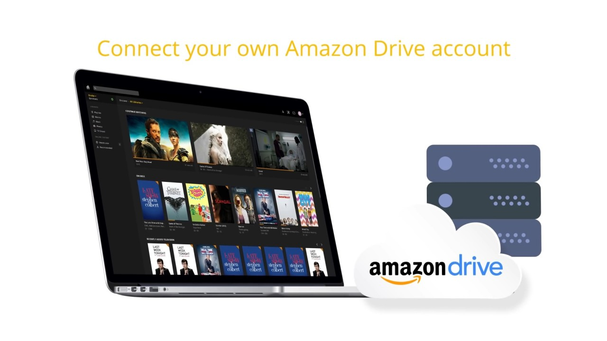

# PlexCloud



Wishing you could still use Amazon's storage for Plex?  Look no further!  This repo will setup Plex in the Cloud automatically!

## Why?

On December 15th, Plex announced [they would no longer be supporting Amazon Cloud Drive](https://www.plex.tv/blog/book-plex-volume-3-plex-cloud/) due to technical limitations.  This project aims to use different techniques to overcome those hurdles, as well as improving upon it by encrypting the data stored.

## Requirements

* [DigitalOcean](https://www.digitalocean.com) Account
* [Ansible](https://www.ansible.com)
* [Terraform](https://www.terraform.io)
* [Terraform-Inventory](https://github.com/adammck/terraform-inventory)

## Setup

See [here](./SETUP.md).

## Running

```bash
$ ./do_it.sh
```

## Directories

In order to operate smoothly, this system utilizes [UnionFS](https://amc.ovh/2015/08/15/uniting-encrypted-encfs-filesystems.html) to allow Plex to access both local files, and content found on Amazon CloudDrive.

Example:
```
/root/movies
├── /root/acd/movies
└── /root/local/movies
```

Transmission downloads files to `/root/downloads`.  CouchPotato will move files into `/root/local/movies`, and a nightly `cron` job will upload them to Amazon CloudDrive, at which point they will be located in `/root/acd/movies`.  In order for files to be available both pre- and post-upload, the folders are joint mounted using UnionFS at `/root/movies`.

## Configuring

### Sonarr

You'll want to add [an indexer](https://github.com/Sonarr/Sonarr/wiki/Supported-Indexers) to Sonarr, so it can find content.

### Couchpotato

Similar to Sonarr, you'll need to add [a search provider](http://www.htpcguides.com/configure-couchpotato-torrent-movies/) so that Couchpotato can find content.